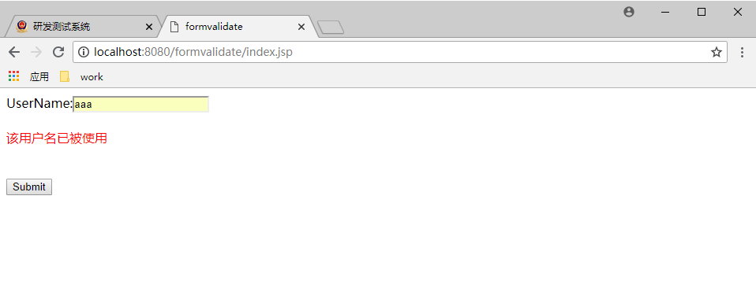

# UsingAjax

由简至繁使用ajax

## 1、原生Ajax

1. 选择元素
2. 取消元素默认行为
3. 创建xhr对象，`var xhr = new XMLHttpReqeust();`
4. 准备数据：url  method  data
5. `xhr.open(method,url)`
6. `xhr.send()`
7. xhr对象添加onreadystatechange函数
8. 判断响应是否完成`xhr.readyState==4`
9. 判断响应是否可用`xhr.status=2xx or 3xx`
```js
window.onload = function () {
    //1、找到元素a
    var e = document.getElementsByTagName("button")[0];
    e.onclick = function () {
        //3.创建xhr对象
        var xhr = new XMLHttpRequest();
        //4、准备发送数据
        var url = "${pageContext.request.contextPath}/static/helloAjax.txt"+"?time="+new Date();
        var method = "GET";
        //5、xhr.open
        xhr.open(method, url);
        //6、xhr.send
        xhr.send(null);
        //7、xhr对象添加onreadystatechange函数
        xhr.onreadystatechange = function () {
            //alert(xhr.readyState);
            //8、判断响应是否完成,readyState=4
            if (xhr.readyState == 4) {
                //9、判断响应是否可用,status 200
                if (xhr.status == 200 || xhr.status == 304) {
                    //10、打印结果responseText
                    alert(xhr.responseText);
                } else {
                    alert("出错了，错误代码" + xhr.status);
                }
            }
        }
        //2、取消默认行为
        return false;
    }
}
```

## 2、使用ajax传输html、xml、json
使用案例：
web/static/ajaxhtml/*  
web/static/ajaxxml/*    
web/static/ajaxjson/*

### 三种优缺点
使用ajax传输XML格式数据
    使用xml的优点
        - xml 是一种通用数据格式
        - 不必把数据强加到已经定义好的格式中，而是要为数据定义合适的标记
        - 利用DOM可用完全掌控文档
    使用xml的缺点
        - 如果文档来自于服务器，就必须得保证文档含有正确的首部信息，若文档类型不正确，那么responseXML的值将是空的
        - 当浏览器接收到很长的xml文件后，DOM解析可能会很复杂
使用ajax传输json格式数据
    优点：
    json是JS的原生数据格式，无需解析
    能到达xml的效果，但是更加轻巧
    json是键值对组成的文档，其值还可以是一个json对象，值也可以是JavaScript方法
    缺点：
    语法过于严禁
    代码不易读
    eval函数存在风险

**小结：** 若应用程序不需要与其他应用程序共享时，使用HTML片段传输最简单
      	    如果数据需要重用，json是不错的选择，性能和文件大小上有优势
     	    当远程应用程序未知时，xml文档首选，因为xml是web服务领域通用的

## 3、jQuery的Ajax

jQuery对ajax操作就进行了封装，在jQuery中有三个层次,列举了几个最常用的：

**最底层：$.ajax()**

```js
//$.ajax({name:value, name:value, ... })
//http://api.jquery.com/jQuery.ajax/
$("button").click(function(){
    $.ajax({
    url:"demo_test.txt",
    type:"POST",
    data:{
      //json args  
    },
    dataType:"json",
    success:function(result){
        $("#div1").html(result);
    }});
});

```
**其次：load(),$.get(),$.post()**

```js

//$(selector).load(url,args,callbacks]):最简单和最常用
$(obj).load(url,args,callbacks);
$('#content').load(url,args);

//$.get(url,callback,type):
$("button").click(function(){
  $.get("demo_test.asp",function(data,status){
    alert("Data: " + data + "\nStatus: " + status);
  });
});

//args为json格式
//$.post(url,arguments,callback):
$("button").click(function(){
  var args = {"time":new Date()};
  $.get("demo_test.asp",,function(data,status){
    alert("Data: " + data + "\nStatus: " + status);
  });
});

```

**最高层：$.getScript(),$.getJSON()**
```js
//getJSON使用的是get方法的xhr
//$(selector).getJSON(url,args,success(data,status,xhr))
$.getJSON(url,args,function (data) {
    var name = data.name;
    var website = data.website;
    var email = data.email;

    $("#details").empty()
        .append("<h2><a href='mailto:" + email + "'>" + name + "</a></h2>")
        .append("<a href='" + website + "'>" + website + "</a>");
});
```


## 4、典型的Ajax案例--表单验证

### 效果



### 实现
src\main\java\com\wangchuncheng\formvalidate\ *
web\formvalidate\ *

## 5、典型的Ajax案例--三级联动

### 效果


### 数据准备

```mysql

-- location
CREATE TABLE location(
  id NUMERIC(10) PRIMARY KEY ,
  city VARCHAR(20)
);

INSERT INTO location VALUES (0001,'Beijing');
INSERT INTO location VALUES (0002,'Chengdu');

SELECT * FROM location;
-- DROP TABLE location;

-- department
CREATE TABLE department(
  id NUMERIC(10) PRIMARY KEY ,
  department_name varchar(20),
  loc_id NUMERIC(10),
  CONSTRAINT loc_f_key FOREIGN KEY(loc_id)  REFERENCES location(id)
);

INSERT INTO department VALUES (0001,'AA',0001);
INSERT INTO department VALUES (0002,'BB',0001);
INSERT INTO department VALUES (0003,'CC',0002);
INSERT INTO department VALUES (0004,'DD',0002);
-- DROP TABLE department;

-- employee
CREATE TABLE employee(
  id NUMERIC(10) PRIMARY KEY,
  name varchar(20),
  email varchar(20),
  salary NUMERIC(10,2),
  depart_id NUMERIC(10),
  CONSTRAINT depart_f_key FOREIGN KEY(depart_id) REFERENCES department(id)
);

INSERT INTO employee VALUES (0001,'Jesse','Jesse@163.com',5000.00,0001);
INSERT INTO employee VALUES (0002,'Jack','Jack@163.com',5500.00,0001);
INSERT INTO employee VALUES (0003,'Tom','Tom@163.com',4000.00,0002);
INSERT INTO employee VALUES (0004,'Mark','Mark@163.com',4500.00,0003);
INSERT INTO employee VALUES (0005,'Mary','mary@163.com',4700.00,0003);
INSERT INTO employee VALUES (0006,'Maria','maria@163.com',6500.00,0004);

-- DROP TABLE employee;
```

### 实现
src\main\java\com\wangchuncheng\controller
src\main\java\com\wangchuncheng\beans
src\main\java\com\wangchuncheng\dao
web/employee.jsp
